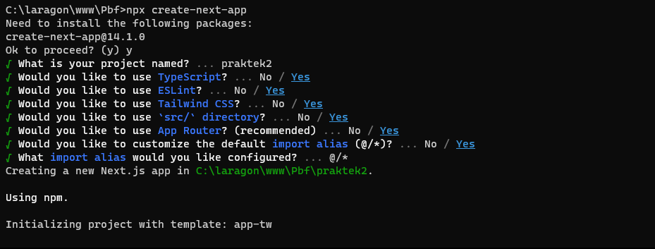
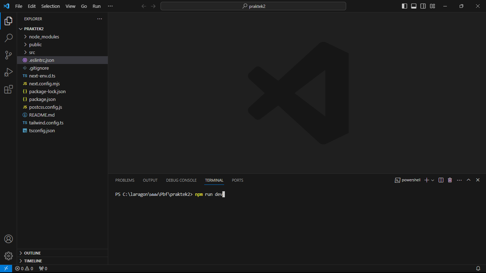
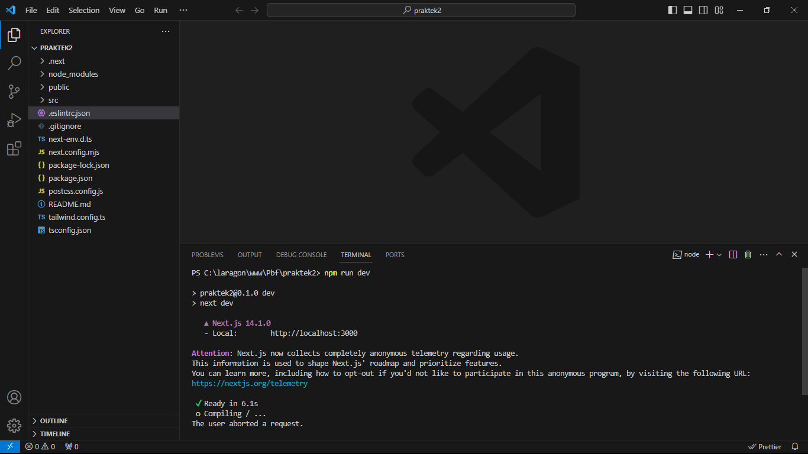
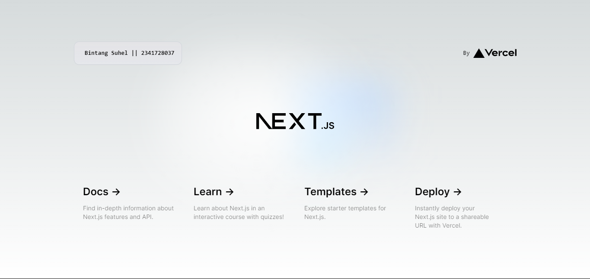
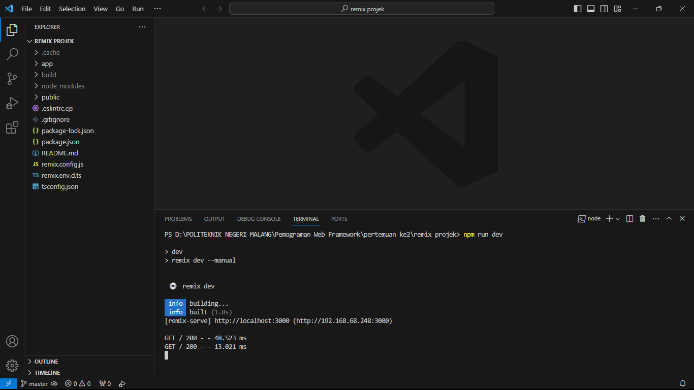
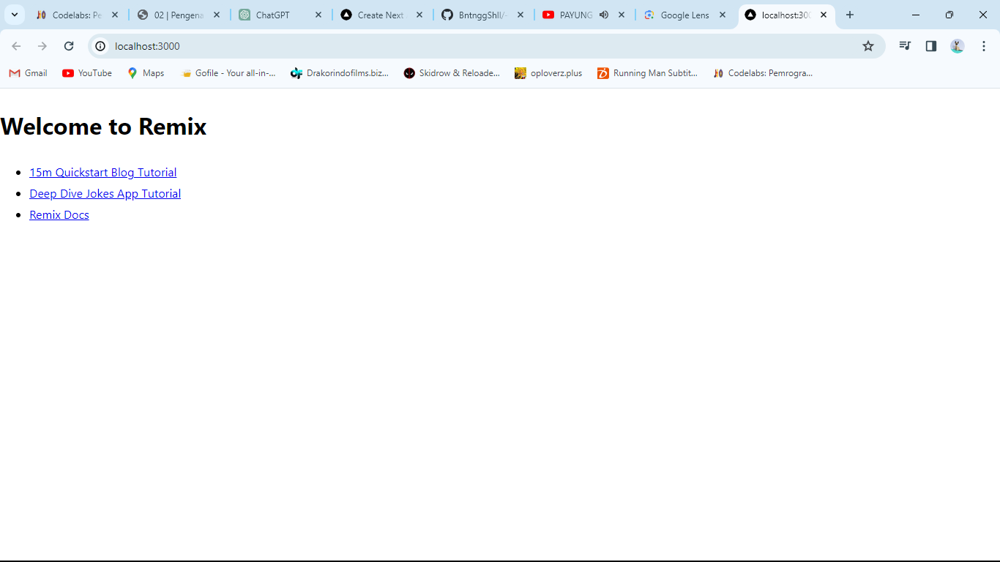
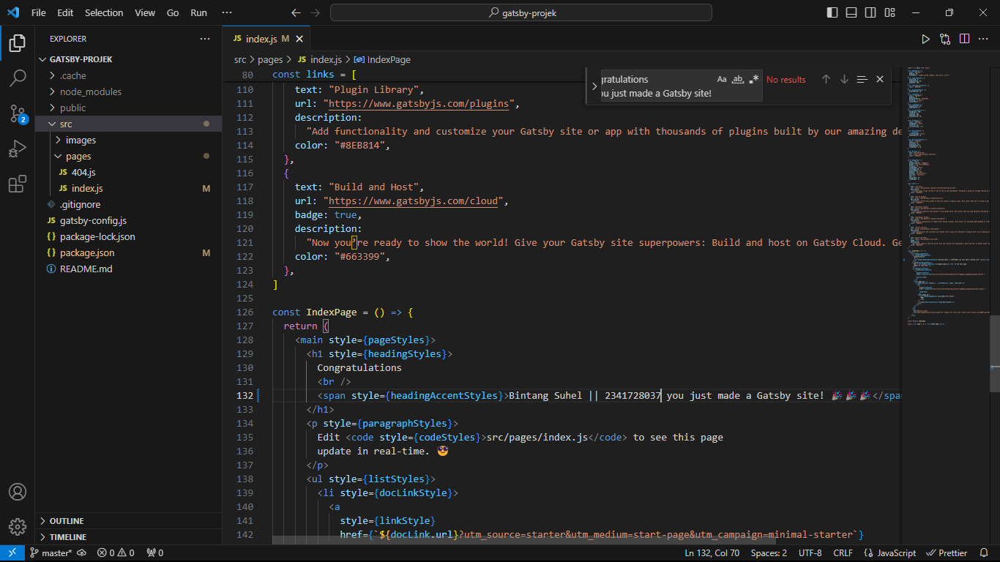
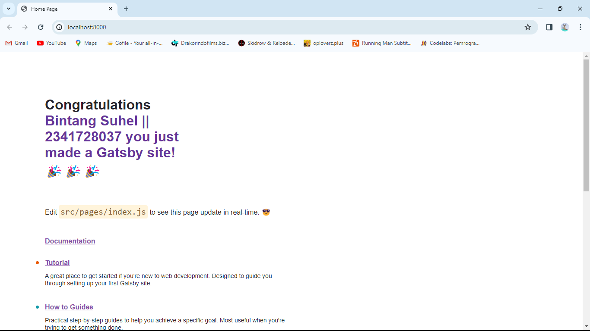

Langkah-langkah 
Step 1 : Buat folder baru

Step 2 : Buat project baru

Soal 1
Pada gambar tersebut, silakan Anda browsing apa yang dimaksud dengan:

TypeScript -> TypeScript adalah superset JavaScript yang menambahkan tipe statis ke bahasa tersebut. Hal ini memungkinkan pengembang untuk menulis kode dengan penekanan lebih besar pada keamanan tipe, menangkap potensi kesalahan selama pengembangan daripada saat runtime. Kode TypeScript diubah menjadi JavaScript biasa, sehingga kompatibel dengan lingkungan JavaScript apa pun.

ESLint -> ESLint adalah alat untuk mengidentifikasi dan memperbaiki kesalahan umum pemrograman, menegakkan standar pengkodean, dan memastikan konsistensi kode. Ini banyak digunakan dalam proyek JavaScript dan TypeScript untuk menganalisis kode dan memberikan umpan balik berdasarkan aturan yang ditentukan. ESLint dapat dikonfigurasi agar sesuai dengan gaya penulisan dan preferensi tim pengembangan.

Tailwind CSS -> Tailwind CSS adalah kerangka kerja CSS yang berfokus pada utilitas yang menyediakan kelas utilitas tingkat rendah untuk membuat desain langsung dalam pengkodean Anda. Tujuannya adalah untuk menyediakan cara yang sangat dapat disesuaikan dan mudah dipelihara untuk merancang aplikasi web dengan menyediakan serangkaian kelas utilitas yang telah ditentukan sebelumnya yang mencakup berbagai kebutuhan desain. Tailwind CSS dapat menjadi pilihan produktif bagi pengembang yang lebih menyukai pendekatan berguna dalam menulis CSS khusus.

App Router ->  sistem router yang digunakan dalam konteks aplikasi web. Router bertanggung jawab untuk mengelola navigasi dan routing dalam aplikasi satu halaman. Ini memungkinkan pengembang untuk menentukan rute untuk tampilan atau komponen yang berbeda, memungkinkan untuk berpindah antara mereka tanpa memicu reload halaman penuh. Pilihan populer untuk aplikasi web berbasis JavaScript/TypeScript termasuk React Router untuk aplikasi React atau Vue Router untuk aplikasi Vue.js.

Import alias -> Import alias adalah cara untuk membuat nama yang lebih singkat dan nyaman untuk modul atau file saat mengimpor mereka dalam kode. Aliases memungkinkan pengembang untuk membuat impor yang lebih singkat dan lebih bersih daripada menggunakan jalur relatif yang panjang. Ini tidak hanya meningkatkan keterbacaan kode tetapi juga memudahkan refaktor atau memindahkan file tanpa perlu memperbarui banyak pernyataan impor. Fitur ini sering digunakan dalam TypeScript dan beberapa bundler seperti Webpack. 

Step 3 : Buka dengan vscode

Soal 2
Pada struktur project tersebut, jelaskan kegunaan folder dan file masing-masing tersebut!
1. Direktori **.git** pada proyek ReactJS atau proyek berbasis Git lainnya adalah direktori yang digunakan oleh sistem kontrol versi Git untuk menyimpan informasi tentang riwayat perubahan (version history) proyek.
2. Direktori **node_modules** pada proyek ReactJS (atau proyek JavaScript lainnya) adalah direktori yang berisi semua dependensi atau paket pihak ketiga yang dibutuhkan oleh proyek Anda. Setiap kali Anda menggunakan npm (Node Package Manager) atau yarn untuk menginstal paket-paket, mereka akan diunduh dan disimpan di direktori node_modules.
3. Direktori **public** pada proyek ReactJS adalah tempat untuk menyimpan file statis yang akan disajikan secara langsung oleh server web tanpa perlu melalui proses bundling atau transformasi. 
4. Direktori **src** pada proyek ReactJS adalah direktori yang umumnya digunakan untuk menyimpan semua file source code (kode sumber) dari aplikasi React.
5. File **.eslintrc.json** pada proyek ReactJS adalah konfigurasi untuk ESLint, alat linting JavaScript yang digunakan untuk menerapkan aturan penulisan kode dan mendeteksi potensi masalah dalam kode sumber. ESLint membantu tim pengembang untuk memelihara kualitas kode yang konsisten dan menerapkan standar penulisan kode tertentu.
6. File **.gitignore** pada proyek ReactJS adalah file konfigurasi yang digunakan untuk menentukan file dan direktori mana yang harus diabaikan oleh Git saat Anda melakukan operasi commit. Ini sangat penting untuk menghindari menyertakan file atau direktori yang tidak perlu dalam repositori Git.
7. File **next.config.mjs** pada proyek React dengan Next.js adalah file konfigurasi untuk aplikasi Next.js yang ditulis dalam format modul JavaScript (ECMAScript Modules). File ini memberikan kemampuan untuk menyesuaikan berbagai pengaturan dan opsi konfigurasi untuk proyek Next.js. 
8. File **next-env.d.ts** pada proyek React dengan Next.js adalah file TypeScript declaration file (dengan ekstensi .d.ts). File ini digunakan untuk mendeklarasikan global types dan environment variables yang diperlukan oleh aplikasi Next.js. 
9. File **package.json** adalah file manifest proyek Node.js yang mencatat informasi tentang proyek dan dependensinya.
10. File **package-lock.json** menyediakan snapshot yang tepat dari dependensi dan versi paket yang digunakan oleh proyek.
11. File **postcss.config.js** adalah konfigurasi untuk PostCSS, alat untuk memproses dan mengoptimalkan gaya CSS.
12. File **README.md** adalah dokumen utama proyek yang memberikan informasi untuk pengembang dan kontributor.
13. File **tailwind.config.ts** adalah konfigurasi untuk Tailwind CSS, sebuah framework utility-first CSS.
14. File **tsconfig.json** adalah konfigurasi TypeScript yang mendefinisikan aturan kompilasi untuk proyek TypeScript.

Step 4 : Run

 
Soal 3

**Tugas**

**Next.js**

**Remix**

**Gatsby**

perbedaan diantara ke-3 Framework 

Next.js, Remix, dan Gatsby adalah tiga framework populer dalam pengembangan web dengan React. Next.js menonjol dengan dukungan bawaan untuk Server-Side Rendering (SSR) dan Client-Side Rendering (CSR), serta sistem routing yang sederhana. Remix menawarkan pendekatan full-stack dengan fokus pada penyatuan pengembangan frontend dan backend, menyertakan model pengambilan data yang terstruktur. Gatsby, yang terkenal sebagai Static Site Generator (SSG), menghasilkan situs web statis dengan performa tinggi, menggunakan GraphQL untuk pengambilan data dan memanfaatkan teknik pengoptimalan kinerja. Pemilihan di antara ketiganya bergantung pada kebutuhan proyek, dengan Next.js cocok untuk aplikasi web universal, Remix untuk integrasi full-stack, dan Gatsby untuk pembuatan situs web statis yang dioptimalkan secara kinerja.