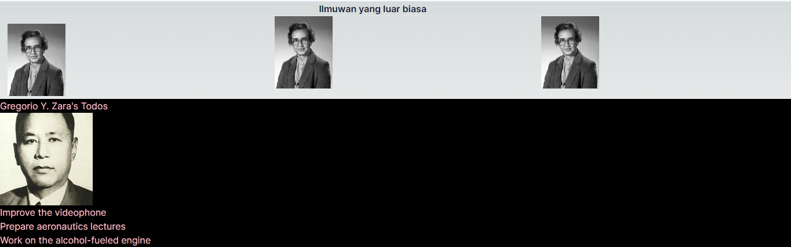

**Praktek 1**
Langkah 1 :Buat Komponen Baru

Langkah 2 : Import Komponen

**Praktek 2**
Langkah 1 :Buat Komponen Baru

Langkah 2 : Import Komponen

**Praktek 3**
Langkah 1 :Buat Komponen Baru

Langkah 2 : Import Komponen

Langkah 3: Ubah ekspresi URL di src

**Praktek 4**
Langkah 1 :Buat Komponen Baru

Langkah 2: Buat fungsi getImageUrl

Langkah 3: Buat komponen baru

Tambahkan fungsi getImageUrlV2 seperti berikut di file yang sama yaitu utils.tsx

Langkah 4: Buat komponen baru MyProfileV2

**Soal**
Soal 1

memanggil gambar dengan menggunakan domain tertentu dalam aplikasi Next.js, Anda perlu mengonfigurasi domain tersebut di file next.config.mjs. Selain itu, penting juga untuk mengimpor komponen yang telah dibuat ke dalam halaman yang dituju, misalnya dengan menggunakan sintaks import Profile from "asal-components". Pada tahap sebelum konfigurasi domain, mungkin terjadi beberapa error yang dapat diatasi dengan menambahkan konfigurasi berikut di file next.config.mjs:

Soal 2

menggunakan komponen Gallery untuk menyederhanakan tampilan pada file page.tsx. Dengan memanfaatkan komponen tersebut, file page.tsx menjadi lebih bersih dan fokus pada pemanggilan komponen yang spesifik.

Soal 3
Error di kode disebabkan oleh penggunaan class sebagai atribut kelas dan kurangnya import React. Perubahan yang saya buat adalah praktik umum dalam pengembangan React. Penggunaan className dan import React adalah konvensi yang harus diikuti agar komponen React berfungsi dengan baik

Soal 5

Modifikasi pada antarmuka melibatkan perubahan signifikan, seperti penggantian warna latar belakang menjadi hitam untuk memberikan nuansa yang berbeda. Selain itu, satu gambar tambahan telah dimasukkan ke dalam tata letak, dilengkapi dengan informasi nama dan deskripsi orang yang terdapat pada gambar tersebut, yang ditempatkan di bagian bawah dari tiga gambar sebelumnya. Untuk mempertegas perbedaan visual, saya juga menyisipkan elemen garis putih sebagai pemisah antar bagian.

Soal 6

Hingga saat ini, terlihat adanya upaya penyederhanaan pada file `page.tsx` karena komponen-komponennya telah dipisahkan ke dalam direktori `../component`. Selain itu, terdapat modifikasi pada tampilan gambar di bagian bawah dengan melakukan perubahan ukuran, yang memberikan sentuhan penyegaran pada elemen visual tersebut.

Soal 7,8,9

Keterhubungan yang baik antar berbagai bagian sangat penting agar komponen dapat dipanggil dan berinteraksi dengan optimal tanpa menghadapi kendala. Pada tampilan akhir ini, terdapat penambahan tiga foto ilmuwan beserta biodata mereka secara berurutan, yang ditempatkan dengan rapi di sudut kiri. Hal ini memberikan sentuhan lebih lanjut pada keberagaman visual dan menyediakan informasi yang relevan terkait ilmuwan tersebut.

