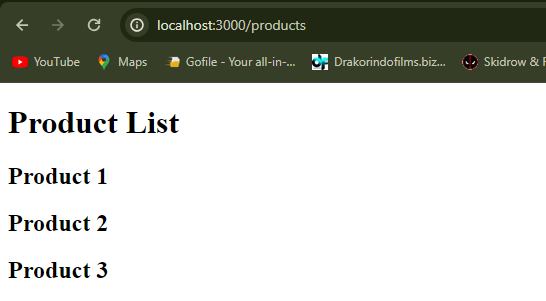
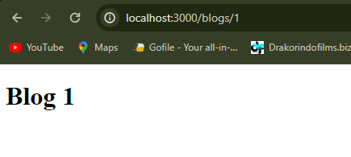

Praktikum 1: Membuat routing sederhana

Halaman Utama

Halaman About

Halaman Profile

Praktikum 2: Membuat routing bersarang (Nested Routing)

Halaman Blogs

Halaman First

Halaman Second

kekurangan dari pendekatan Nested Routing
-Nested routing dapat menghasilkan ketergantungan yang tinggi antara komponen, karena satu komponen mungkin perlu tahu di mana ia berada dalam hierarki rute untuk berfungsi dengan benar.
-Semakin dalam tingkat nested routing, semakin kompleks struktur rute dan logika navigasi aplikasi Anda. Ini bisa sulit dipelihara dan memahami, terutama saat proyek menjadi lebih besar.

Praktikum 3: Membuat routing dinamis (Dynamic Routing)

Halaman Products

Halaman Products/1

Halaman Products/2

Halaman Products/3

Halaman Todo 1

Halaman Todo 2

