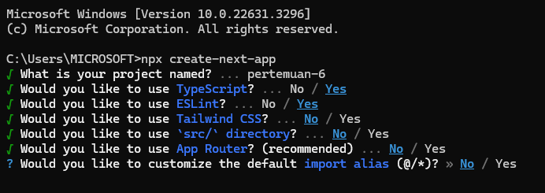
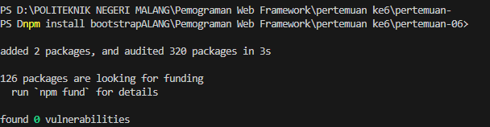
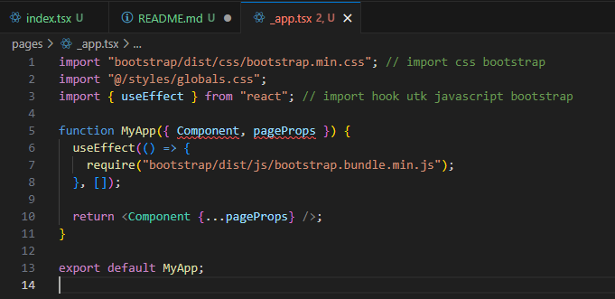
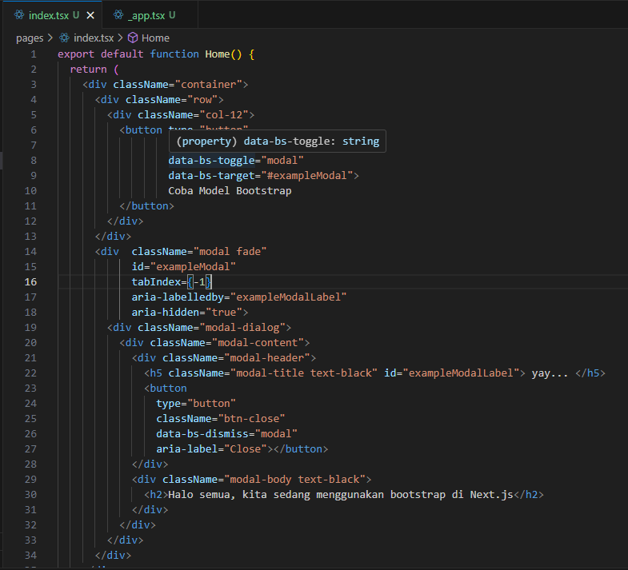
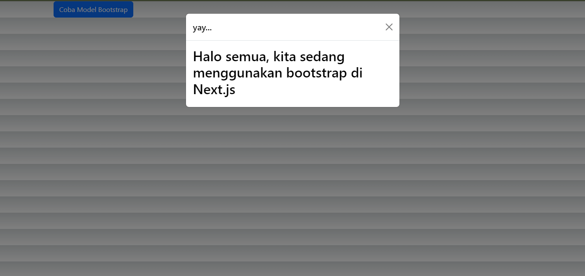

Praktikum 1: Instalasi Redux dan bootstrap

Langkah 1 : install project next.js baru

Langkah 2 : install bootstrap

Langkah 3 : implementasi bootstrap pada project next.js

Langkah 4 : edit file pages/index.tsx

Hasil : install project next.js baru

laporan : Kodingan Dapat dijalankan dan menampilkan botton yang ketika di click akan muncul Modal

